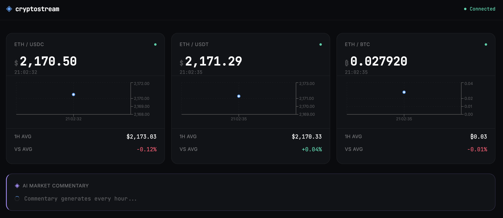

# cryptostream

Real-time cryptocurrency dashboard streaming live ETH/USDC, ETH/USDT, and ETH/BTC prices from Finnhub, with AI-generated hourly market commentary powered by Claude.



## Features

- Live price streaming via Socket.IO — prices update in real time without polling
- Three currency pairs: ETH/USDC, ETH/USDT, ETH/BTC
- Rolling 50-tick price chart per pair (Recharts)
- Hourly average vs. current price with percentage change
- AI market commentary generated every hour by Claude (Anthropic)
- WebSocket reconnection with exponential backoff
- Connection status indicator
- Responsive layout with dark theme

## Architecture

```
Finnhub WebSocket
      │
      ▼
┌─────────────────────────────────────────┐
│  NestJS Backend (hexagonal)             │
│                                         │
│  infrastructure/  ← Finnhub WS adapter │
│  application/     ← use cases           │
│  domain/          ← pure types, ports  │
│                                         │
│  ProcessRateTickUseCase                 │
│  GetHourlyAverageUseCase                │
│  PersistHourlyAverageUseCase            │
│  GenerateCommentaryUseCase (hourly)     │
└───────────────┬─────────────────────────┘
                │ Socket.IO (rate_update, commentary_update)
                ▼
┌─────────────────────────────────────────┐
│  React Frontend (Feature-Sliced Design) │
│                                         │
│  app/       ← providers, global styles  │
│  widgets/   ← PairCard, RateChart,      │
│               CommentaryWidget          │
│  features/  ← Zustand stores, hooks     │
│  shared/ui/ ← atoms → molecules →       │
│               organisms                 │
└─────────────────────────────────────────┘
                │
      PostgreSQL (rates, hourly_averages)
```

## Tech Stack

| Layer | Technologies |
|---|---|
| Backend | NestJS · TypeORM · PostgreSQL · Socket.IO · Zod · Swagger |
| Frontend | React · Vite · Zustand · Recharts · Tailwind CSS |
| AI | Anthropic SDK (Claude) |
| Shared | `@crypto/shared` — cross-boundary types and Socket.IO event constants |
| Testing | Vitest · React Testing Library · Playwright |
| Visual | Storybook |

## Local Setup

**Prerequisites:** Node.js 20+, Docker (for PostgreSQL)

```bash
# 1. Clone and install
git clone https://github.com/marianozamora/crypto-dashboard.git
cd crypto-dashboard
npm install

# 2. Environment variables
cp .env.example .env
cp backend/.env.example backend/.env
```

Edit `backend/.env` with your API keys:

| Variable | Description |
|---|---|
| `FINNHUB_API_KEY` | Finnhub WebSocket API key — [finnhub.io](https://finnhub.io) |
| `ANTHROPIC_API_KEY` | Claude API key — [console.anthropic.com](https://console.anthropic.com) |
| `DATABASE_URL` | PostgreSQL connection string (default works with Docker) |
| `PORT` | Backend port (default: `3001`) |
| `FRONTEND_URL` | CORS origin (default: `http://localhost:3000`) |

Frontend `.env` (optional — defaults work out of the box):

| Variable | Description |
|---|---|
| `VITE_WS_URL` | Backend WebSocket URL (default: `http://localhost:3001`) |

```bash
# 3. Start database
docker compose up postgres -d

# 4. Run migrations
cd backend && npm run migration:run && cd ..

# 5. Start dev server
npm run dev
```

Or run everything with Docker:

```bash
docker compose up
```

## Local URLs

| Service | URL |
|---|---|
| Frontend | http://localhost:3000 |
| Backend API | http://localhost:3001 |
| Swagger UI | http://localhost:3001/api/docs |
| Storybook | http://localhost:6006 |

## Commands

| Command | Description |
|---|---|
| `npm run dev` | Backend + frontend concurrently |
| `npm run dev:backend` | NestJS in watch mode |
| `npm run dev:frontend` | Vite dev server |
| `npm run test` | All unit tests (backend + frontend) |
| `npm run test:e2e` | Playwright E2E tests |
| `npm run lint` | ESLint backend + frontend |
| `npm run type-check` | TypeScript check backend + frontend |
| `npm run build` | Production build |
| `npm run storybook` | Storybook dev server |

### Database migrations (backend)

```bash
cd backend
npm run migration:run       # apply pending migrations
npm run migration:revert    # roll back last migration
npm run migration:generate -- src/migrations/MyChange  # generate from entity diff
npm run migration:create -- src/migrations/MyChange    # empty migration scaffold
```

## Project Structure

```
monorepo/
├── shared/                    @crypto/shared — RateUpdate, MarketCommentary, SOCKET_EVENTS
├── backend/src/
│   ├── rates/
│   │   ├── domain/            pure types and port contracts (no framework deps)
│   │   ├── application/       use cases — orchestrate domain, call ports
│   │   └── infrastructure/    NestJS controllers, TypeORM repos, Finnhub WS adapter
│   ├── ai/                    GenerateCommentaryUseCase — hourly Claude call
│   ├── migrations/            TypeORM migration files
│   └── shared/                DI tokens, logger, config, Zod env validation
└── frontend/src/
    ├── app/                   providers (WebSocketProvider), global styles
    ├── pages/                 DashboardPage — page composition only
    ├── widgets/               PairCard · RateChart · CommentaryWidget · ConnectionStatus
    ├── features/              Zustand stores, useWebSocket hook, useRates hook
    └── shared/ui/
        ├── atoms/             Badge · PriceTag · Spinner
        ├── molecules/         PriceDisplay · StatRow
        └── organisms/         DataCard
```

## Testing

```bash
npm run test              # 202 unit + integration tests (73 backend, 129 frontend)
npm run test:e2e          # Playwright E2E (dashboard, connection, reconnection, charts)
cd frontend && npm run test:coverage   # coverage report (threshold: 80%)
```

**Coverage:**
- Every use case: happy path + error paths
- Every Zustand store and selector
- Every React hook (loading, connected, error states)
- Integration tests: WebSocket event → store update → DOM re-render (no manual rerender)
- E2E: initial load, real-time price updates, offline/reconnection, chart data rendering

## Design System

Storybook documents the full component library with live interactive stories:

```bash
npm run storybook   # http://localhost:6006
```

Component hierarchy:
- **Atoms** — `Badge`, `PriceTag`, `Spinner` (zero domain knowledge)
- **Molecules** — `PriceDisplay`, `StatRow` (compose atoms)
- **Organisms** — `DataCard` (accepts domain types as props, no data fetching)
- **Widgets** — `PairCard`, `RateChart`, `CommentaryWidget`, `ConnectionStatus` (connected to Zustand via decorator pattern)

## API

The backend exposes a REST health endpoint and a Socket.IO interface:

**Socket.IO events (server → client):**

| Event | Payload type | Description |
|---|---|---|
| `rate_update` | `RateUpdate` | New price tick for a currency pair |
| `commentary_update` | `MarketCommentary` | Hourly AI-generated market analysis |

**REST:**

| Endpoint | Description |
|---|---|
| `GET /health` | `finnhubConnected`, `connectedClients`, `uptime`, `timestamp` |
| `GET /api/docs` | Swagger UI |

## CI/CD

GitHub Actions runs on every push to `main`:

1. Type-check `@crypto/shared`
2. Backend — lint · type-check · unit tests + coverage
3. Frontend — lint · type-check · unit tests + coverage
4. Storybook — static build verification
5. E2E — Playwright against Docker Compose stack
6. Deploy — Vercel (frontend + Storybook on separate projects)
